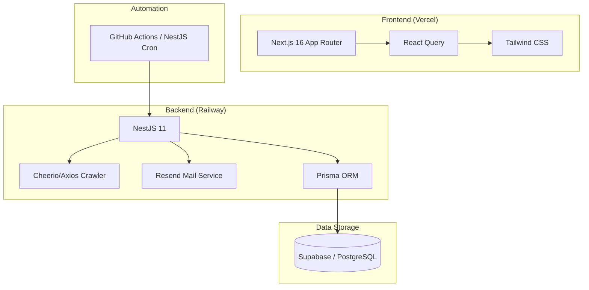

# 🔔 공모주 알리미 (Gongmoju Info)

> **"복잡한 공모주 일정을 한눈에, 스마트한 투자 결정을 돕는 기술 중심 대시보드"**


공모주 알리미는 흩어져 있는 IPO 정보를 수집하여 데이터 기반의 인사이트를 제공하는 **모바일 환경 최적화 웹 서비스**입니다. 실시간 데이터 스크래핑부터 매주 월요일 아침 자동 리포트 발송까지, 전체 워크플로우를 자동화하여 투자자의 생산성을 극대화합니다.

Web Link : https://gongmoju-info-client.vercel.app/


---

## ⚡️ Full Vibe Coding: AI Native Development

본 프로젝트는 단순한 코드 작성을 넘어, **AI 에이전트와 긴밀하게 협업하는 'Full Vibe Coding' 방식**으로 구현되었습니다.

*   **Agile Iteration**: 요구사항 정의부터 배포까지 AI와 실시간으로 페어 프로그래밍을 진행하며, 기존 방식 대비 약 5배 빠른 속도로 기능을 릴리즈했습니다.
*   **Prompt Engineering**: 복잡한 비즈니스 로직(공모주 점수화 알고리즘 등)을 자연어로 기술하고 AI가 최적의 타입스크립트 코드로 변환하는 프로세스를 정립했습니다.
*   **Quality with Speed**: 빠른 구현 속도 속에서도 단위 테스트와 정적 분석을 AI가 병행 수행하여 견고한 코드 품질을 유지했습니다.

---

## 🛠 Tech Stack & Architecture

### High-Level Architecture


### Key Technologies
*   **Client**: `Next.js 16`, `React 19`, `Tailwind CSS`, `Shadcn UI`, `TanStack Query v5`
*   **Server**: `NestJS 11`, `Prisma`, `Cheerio` (Scraping), `Resend` (Email SDK)
*   **Infrastructure**: `Supabase`, `Railway`, `Vercel`, `GitHub Actions`
*   **DevOps**: `ESLint`, `Prettier`, `TypeScript 5.7`

---

## 🚀 Key Features

### 1. 지능형 데이터 스크래핑 및 스케줄링
- `Cheerio`를 활용하여 주요 공모주 정보 사이트에서 실시간 데이터를 파싱합니다.
- `NestJS @Cron`을 통해 매일 08:29, 09:30 KST에 데이터를 최신화합니다.

### 2. 자동 주간 리포트 시스템 (Newsletter)
- 구독자를 대상으로 매주 월요일 08:30 KST에 **이번 주 청약 및 상장 일정 리포트**를 자동 발송합니다.
- `Resend` API를 활용하여 딜리버리 신뢰성을 확보하고 수신 거부(Unsubscribe) 기능을 포함합니다.

### 3. 직관적인 대시보드 UI
- **Mobile First**: 스마트폰에서 가장 보기 편한 카드 형태의 UI와 가로 스크롤 위젯을 제공합니다.
- **Glassmorphism**: 현대적인 디자인 트렌드를 반영한 반투명 테마와 부드러운 애니메이션(Framer Motion/Tailwind Animate)을 적용했습니다.

### 4. 고성능 및 SEO 최적화
- `Next.js 16`의 Server Components와 ISR(Incremental Static Regeneration)을 활용하여 빠른 로딩 속도와 최신 데이터를 동시에 보장합니다.
- Open Graph, 메타 태그, 시맨틱 태그 설계를 통해 검색 엔진 최적화 및 SNS 공유 기능을 강화했습니다.

---

## 🏗 Engineering Excellence

> [!IMPORTANT]
> **실무 수준의 안정성을 위해 다음과 같은 기법들이 적용되었습니다.**

*   **Security**: `Helmet`을 통한 보안 헤더 설정, `Throttler`를 이용한 Rate Limiting 적용.
*   **CORS Management**: 엄격한 화이트리스트 기반의 오리진 허용 정책 수립.
*   **Data Validation**: `class-validator`와 `class-transformer`를 통한 엄격한 API 입출력 검증.
*   **Error Handling**: 전역 예외 필터(Global Exception Filter)를 통한 통합 로깅 및 에러 응답 구조화.

---

## 📂 Project Structure

```text
.
├── client/           # Next.js 16 Frontend
│   ├── src/app/      # App Router 기반 페이지 구성
│   ├── src/components/ # 재사용 가능한 UI 컴포넌트 (Dashboard, Layout 등)
│   └── src/providers/ # React Query 및 테마 설정
└── server/           # NestJS 11 Backend
    ├── src/crawler/   # 공모주 데이터 파싱 로직
    ├── src/ipo/       # 공모주 비즈니스 로직 및 API
    ├── src/mail/      # 이메일 발송 서비스
    └── src/scheduler/ # CronJob 자동화 설정
```

---

## 🏁 Getting Started

### Prerequisites
- Node.js 20+
- pnpm (Recommended)

### Installation
```bash
# Repository 클론
git clone https://github.com/your-username/gongmoju-info.git

# Client 설정
cd client && pnpm install && pnpm run dev

# Server 설정
cd ../server && pnpm install && pnpm run start:dev
```
